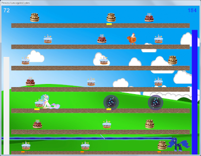
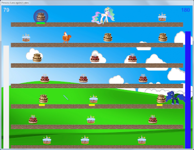

Игра по мотивам MLP:FiM про Принцессу Луну, Принцессу Селестию и тортики.\
На базе C#, NET.Core и SFML.

## О проекте

Задача игры - уничтожить Принцессой Луной все кексы на карте до того, 
как принцесса Селестия сьест их в критичном для себя количестве.
Принцесса Луна может перемещаться влево-вправо по платформам,
телепортироваться между платформами, стрелять роголазером по уровню
платформы, призывать куриц и устанавливать щиты на кексы.

 

## Состав репозитория

* `data` - каталог контента игры (графика, звуки, тексты)
* `graphics` - иконки игры для дистрибутива и AppImage
* `LunaDenyCakesGame` - исходный код игры в виде проектов для Visual Studio и dotnet.
Включает зависимость SFML.Net
* `setup` - скрипты сборки игры, а также создания дистрибутивов/архивов для Windows, 
и AppImage для Linux

## Инструменты сборки

Для сборки проекта нужен установленный
[NetCoreSDK 3.1](https://dotnet.microsoft.com/en-us/download/dotnet/3.1)
(в теории, должно работать с любой версией NET)

Создание дистрибутива для Windows выполняется с помощью программы
[NSIS](https://nsis.sourceforge.io)

Создание архива для Windows выполняется с помощью консольной версии архиватора 
[7-Zip](https://www.7-zip.org)

Для создания AppImage под Linux необходим инструмент сборки AppImageKit - 
[appimagetool-x86_64.AppImage](https://github.com/AppImage/AppImageKit/releases)

## Сборка, запуск игры и создание дистрибутивов

### Сборка

Проект может быть как открыт для компиляции в Visual Studio, так и собран командой `dotnet` 
из каталога, где находится файл `LunaDenyCakesGame.csproj`
(т.е. `LunaDenyCakesGame/LunaDenyCakesGame` относительно корня проекта):

```
dotnet build -c Release
```
Возможно, нужно будет поставить зависимость SFML.Net:
```
dotnet add package SFML.Net
```
Если возникает ошибка типа `error NU1101: Unable to find package Microsoft.NETCore.App...`,
то нужно поменять версию рантайма в файле `LunaDenyCakesGame.csproj`.

Для этого сначала командой `dotnet --list-runtimes` нужно посмотреть текущую версию
`Microsoft.NETCore.App`, а потом вписать её между тегами `<RuntimeFrameworkVersion>` и
`</RuntimeFrameworkVersion>`, и соответствующую версию фреймворка (можно посмотреть
[здесь](https://learn.microsoft.com/ru-ru/dotnet/standard/frameworks) по соответствию
с имеющейся версией dotnet) - между тегами `<TargetFramework>` и `</TargetFramework>`
вместо стоящих там по умолчанию, например, так:

```
<TargetFramework>net6.0</TargetFramework>
<RuntimeFrameworkVersion>6.0.10</RuntimeFrameworkVersion>
```

### Запуск

После сборки в подкаталоге `bin/Release/` появится каталог со всеми необходимыми бинарными
файлами (название каталога будет идентично тому, что указано как `TargetFramework` в файле
`LunaDenyCakesGame.csproj`, по умолчанию `netcoreapp3.1`), включая в том числе файл
`LunaDenyCakesGame.exe`. Также нужно в этот каталог скопировать все файлы и подкаталоги
из каталога `data` (именно внутренности каталога `data`, а не сам этот каталог!),
после чего для запуска игры нужно запустить `LunaDenyCakesGame.exe`.

Если возникает ошибка `You must install .NET to run this application.`, возможно,
следует указать путь к dotnet с помощью переменной окружения `DOTNET_ROOT`, например, так:

```
DISPLAY=:0 DOTNET_ROOT=/opt/mcst/dotnet/dotnet/ ./LunaDenyCakesGame
```

Если возникает ошибка `Unable to load shared library 'csfml-graphics'`, то необходимо
собрать и поставить [CSFML](https://github.com/SFML/CSFML).

Если игра при запуске выпадает с segmentation fault, то возможно, дело в том, что
на выбранном дисплее не поддерживается OpenGL. Если запущенная на данном дисплее
команда `glxinfo` говорит что-то вроде `Error: couldn't find RGB GLX visual or fbconfig`,
то это как раз такой случай.

### Создание дистрибутивов

Создание архива и дистрибутива для Windows выполняется автоматически при
запуске файла `build64.bat` из каталога `setup/windows` 
(может потребоваться указать путь к компилятору NSIS).\
Для создания AppImage под Linux сначала нужно выполнить под Windows файл `build64.bat`
из каталога `setup/linux`, после чего скопировать весь каталог проекта 
(включая каталог вывода сборки `build-LunaDenyCakesGame`) на 64-битную
систему Linux и выполнить в `setup/linux` скрипт `make_appimage64.sh` - в каталоге `/tmp`
появятся готовые образы AppImage для 64-битной версии Linux.
При наличии установленного dotnet на Linux можно объединить эти шаги и обойтись без
компиляции проекта на Windows.
